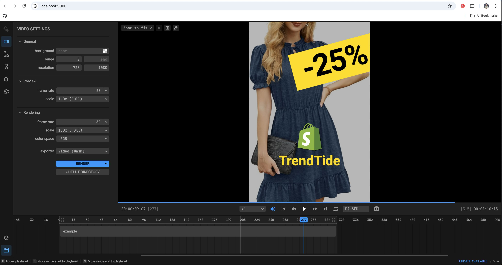

# discount-promo

A demo project showcasing the parameterized video feature supported by Revideo.

## Prerequisites

- Node.js >= 16 is required.
- Install dependencies:

```sh
npm install
```

## Running in Local Development Mode

To start the project in development mode:

```sh
npm start
```

## Rendering Video via CLI

To render the video using the command line:

```sh
npm run render
```

## Starting a Render API

To start a render API server:

```sh
npx revideo serve --project ./src/project.ts --port 3000
```

## Video Effects Preview in the Editor


